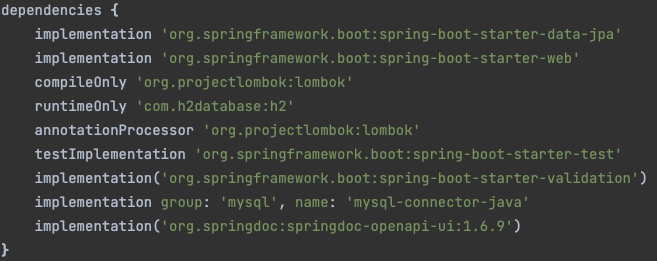
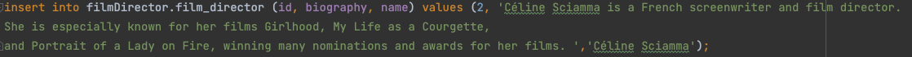

# Spring-Boot

This project is build with Spring boot using Dockers.
See the result in this [swagger](http://localhost:8080/swagger-ui.html).

| Name                                 | Description                                                                                                           |
|:-------------------------------------|:----------------------------------------------------------------------------------------------------------------------|
| Setup                                |                                                                                        |
| Run the App                          | docker-compose up    run Application                                                                              |  
| Add a new   female Film Director | Using POSTMAN        Using SQL console  |
| Run test                             | npm run test                                                                                                          | 
| JDK version                          | version "11.0.15"                                                                                                     | 

