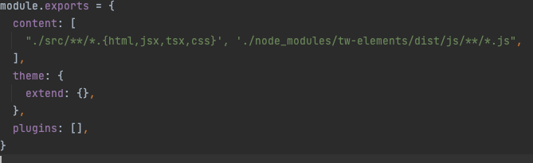
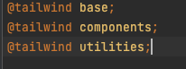

# Login/Signup Form with Tailwind CSS, React, Redux and Typescript

## Project Setup

Inside a directory of your choice, create a new React project by running:

### `npx create-react-app login-signup-form`

Next, move inside the project and install react-router-dom by running:

### `cd create-react-app react-tailwind-app && npm i react-router-dom`

Install redux toolkit

### `npm install @reduxjs/toolkit react-redux`

## Setting and configuring Tailwind CSS

Install Tailwind CSS and its related dependencies by running the following command in the root directory:

### `npm install -D tailwindcss postcss autoprefixer`

Next, generate some configurational files by running the following command in the root directory:

### `npx tailwindcss init -p`

That should generate a tailwind.config.js file and postcss.config.js file for you as shown:

Now, go ahead and update the tailwind.config.js file to support templates for your React component files as shown:

Almost there! We'll now add some necessary Tailwind directives to your index.css file present in the root directory:

## Setting ESLint on a React Typescript project

Install typescript

### `npm install -g typescript`

Install ESLint

### `npm install eslint --save-dev`

Inside the project directory, open a terminal.

On terminal, run:
### `npx eslint --init`

If you want to know more about ESLint and Typescript, I recommend you to read [this article](https://andrebnassis.medium.com/setting-eslint-on-a-react-typescript-project-2021-1190a43ffba). 

